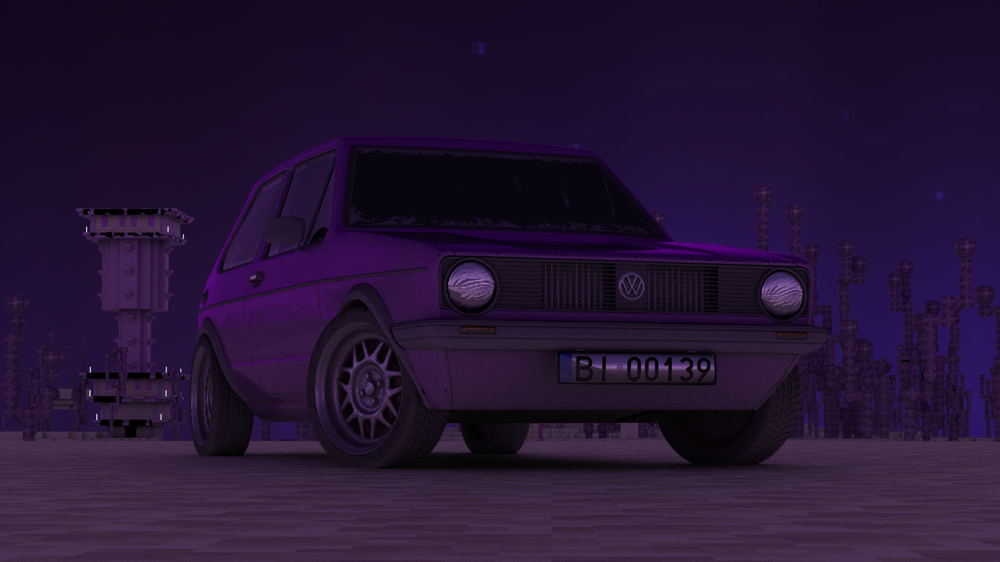
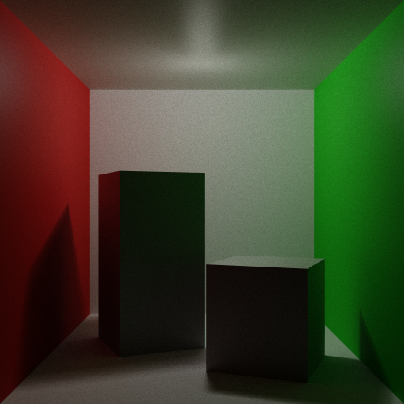
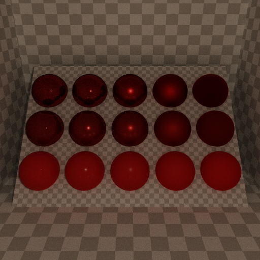

# MiTrace

MiTrace is a CPU-based path tracer written in C++20. It renders physically-accurate images by simulating light transport through GLTF scenes using Monte Carlo sampling. The renderer includes a Cook-Torrance BRDF, BVH acceleration, multi-threaded tile-based work distribution, and an optional real-time preview window. It's still work-in-progress so some rough edges are still there. ^^

## Gallery

### Hero Render



### Featured Scenes

| | |
|---|---|
|  |  |

## Features

### Rendering Algorithms

- **Cook-Torrance BRDF** - GGX microfacet distribution, Schlick-Fresnel, Smith geometry masking, split diffuse/specular
- **Russian-roulette path termination** - configurable energy threshold to limit path depth
- **Statistical firefly elimination** - configurable threshold in standard deviations to clamp outlier samples

### Performance

- **Multi-threaded path tracing** - work distributed across all CPU cores in configurable tiles
- **BVH acceleration structure** - SAH-based construction with configurable max triangles per leaf and max depth
- **CPU affinity pinning** - optional worker thread pinning for cache efficiency

### Scene Features

- **GLTF scene loading** - `.gltf` files with multi-scene and multi-camera support
- **PBR textures** - base color, metallic/roughness, normal maps, occlusion, emissive
- **Point lights** - with configurable radius and color/intensity
- **HDRI / environment lighting** - loaded from GLTF or CLI-overridden; supports rotation and separate primary/secondary intensity

### Output & Visualization

- **Export formats** - PNG, JPEG, HDR
- **Live preview window** - optional GLFW + ImGui + OpenGL real-time preview (5 FPS refresh); compile-time optional via `ENABLE_PREVIEW_GUI`

## Architecture

MiTrace follows a **three-stage pipeline**:

### 1. **Loader** - Scene Import

Reads `.gltf` files and extracts scene data: meshes, materials, textures, cameras, lights, and transforms. Produces intermediate loader types.

### 2. **Scene** - Intermediate Representation

Converts loader types into a renderable scene: builds material cache, loads textures into memory, constructs BVH acceleration structures, and stores cameras/lights for path tracing.

### 3. **Tracer** - Path Solver

Multi-threaded Monte Carlo path tracer. Distributes work via a tile queue across worker threads. Each thread:
- Generates primary rays from the camera
- Traces rays through the scene (BVH intersection tests)
- Evaluates materials and lighting at hit points
- Samples indirect illumination recursively
- Accumulates contributions to a shared render buffer

### 4. **Preview** (Optional)

Live visualization during render via GLFW window + ImGui overlay. Periodically samples the accumulated render buffer and displays it at 5 FPS. Compile-time optional via `ENABLE_PREVIEW_GUI` CMake option.

### Output

Accumulated render buffer is tone-mapped and exported to PNG, JPEG, or HDR format.

## Dependencies

All dependencies are fetched automatically by CMake via `FetchContent`.

| Library | Purpose |
|---|---|
| [argparse](https://github.com/p-ranav/argparse) | CLI argument parsing |
| [nlohmann/json](https://github.com/nlohmann/json) | GLTF JSON parsing |
| [spdlog](https://github.com/gabime/spdlog) | Logging |
| [GLM](https://github.com/g-truc/glm) | Math (vectors, matrices) |
| [stb](https://github.com/nothings/stb) | Image load/write |
| [GLFW](https://github.com/glfw/glfw) | Window/OpenGL context _(preview only)_ |
| [Dear ImGui](https://github.com/ocornut/imgui) | Preview UI _(preview only)_ |

## Building

Requirements: CMake ≥ 3.16, a C++20-capable compiler, OpenGL development headers (for preview).

```bash
cmake -B build -DCMAKE_BUILD_TYPE=Release
cmake --build build --parallel
```

### CMake options

| Option | Default | Description |
|---|---|---|
| `ENABLE_PREVIEW_GUI` | `ON` | Build the live preview window |
| `TARGET_ARCH` | `native` | `-march=` target (e.g. `x86-64`, `native`) |
| `CMAKE_BUILD_TYPE` | `Release` | `Release` / `RelWithDebInfo` / `Debug` |

`Release` and `RelWithDebInfo` compile with `-Ofast -flto -march=<TARGET_ARCH>`.  
`Debug` compiles with `-O0 -g -fsanitize=address,undefined`.

The binary is written to `build/MiTrace`.

## Usage

```
MiTrace <input.gltf> [options]
```

### Options

| Flag | Default | Description |
|---|---|---|
| `input` | _(required)_ | Path to `.gltf` scene file |
| `-o, --output` | auto-generated | Output path; extension sets format (`.png`, `.jpg`, `.hdr`) |
| `-w, --width` | `1280` | Image width in pixels |
| `-h, --height` | `720` | Image height in pixels |
| `-s, --samples` | `64` | Samples per pixel |
| `-b, --bounces` | `5` | Maximum path bounces |
| `-c, --camera` | `0` | Camera index within the GLTF scene |
| `--scene` | `0` | Scene index within the GLTF file |
| `-e, --ev-exposure` | `8.0` | EV exposure applied during tone-mapping |
| `-hdri, --hdri-override` | - | Override environment with an `.hdr` or `.png` file |
| `--hdri-rotation` | `0.0` | HDRI rotation in degrees |
| `--hdri-primary-intensity` | `350.0` | Intensity multiplier for primary rays |
| `--hdri-secondary-intensity` | `350.0` | Intensity multiplier for secondary (indirect) rays |
| `--emission-base-intensity` | `1.0` | Base multiplier for emissive materials |
| `--disable-bvh` | - | Disable the BVH (brute-force intersection) |
| `--bvh-max-triangles` | `32` | Maximum triangles per BVH leaf |
| `--bvh-max-depth` | `32` | Maximum BVH recursion depth |
| `--image-block-size` | `32` | Tile size for work distribution |
| `--disable-firefly-elimination` | - | Disable statistical firefly clamping |
| `--firefly-threshold` | `6.0` | Firefly clamp threshold (standard deviations) |
| `--terminate-energy` | `0.01` | Path termination energy threshold |
| `-t, --threads` | hw concurrency | Number of worker threads |
| `--disable-cpu-affinity` | - | Disable CPU affinity pinning |
| `-p, --preview` | - | Open live preview window |
| `-x, --exit-preview-when-done` | - | Close preview window automatically after render |
| `-v, --verbose` | - | Verbose logging |
| `-V, --very-verbose` | - | Very verbose logging |

### Example

```bash
# Render cornell box at 1080p, 256 spp, with live preview
./build/MiTrace assets/scenes/cornell_box/scene.gltf \
    -w 1920 -h 1080 -s 256 -b 8 \
    -o outputs/cornell.hdr \
    --preview --exit-preview-when-done
```

Output files that are not given an explicit name are auto-generated as `outputs/render_<DDMMYYYY_HHMM>.png`.

## Blender Exporter

A Blender add-on for exporting scenes to GLTF in a format compatible with MiTrace is located in `scripts/blender/mitrace_gltf_exporter/`. A pre-packaged `.zip` for installation via *Edit → Preferences → Add-ons → Install* is provided at `scripts/blender/mitrace_gltf_exporter.zip`.

## Roadmap

### V1 Goals

- [ ] Break up the golf scene to be uploaded as 2 files (size limit)
- [ ] Proper low-roughness non-metals
- [ ] Add skybox loading from GLTF file
- [ ] Generalize the Texture class
- [ ] Test the Blender exporter
  - [ ] Skybox export
  - [ ] Lights export
- [ ] Add mesh-level BVH
- [ ] Fix the light radius problem
- [ ] Add multiple light types
- [ ] Improve the light selection algorithm
- [ ] Add bidirectional path tracing
- [ ] Add alpha (non-physical) transparency
- [ ] Add light bending on transparency
- [ ] Integrate OpenImageDenoise
- [ ] Add debug render modes
  - [ ] Intersections: BVH depth, primary BVH tests, total BVH tests
  - [ ] Material: albedo, metallic/roughness, geometric normal, shading normal
  - [ ] Contributions: direct only, indirect diffuse, indirect specular, indirect all, emission
  - [ ] Random color: per mesh, per triangle, per bounding volume
  - [ ] Other: bounces, depth, first-hit Fresnel/BRDF/PDF, reflected direction, pixel standard deviation

### Completed

- [x] Move the tracer back to the tracer directory
- [x] Add camera selection
- [x] Add GLTF scene selection
- [x] Add skyboxes
