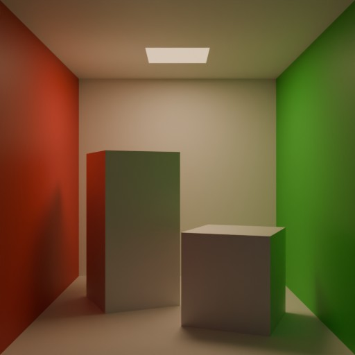

# Cornell box



## Note

Unfortunatelly blender is unable to export area lights (since there's no extension for them), thankfully we can add them manually. Run the following command to add them.
```sh
python3 add_light.py
```
